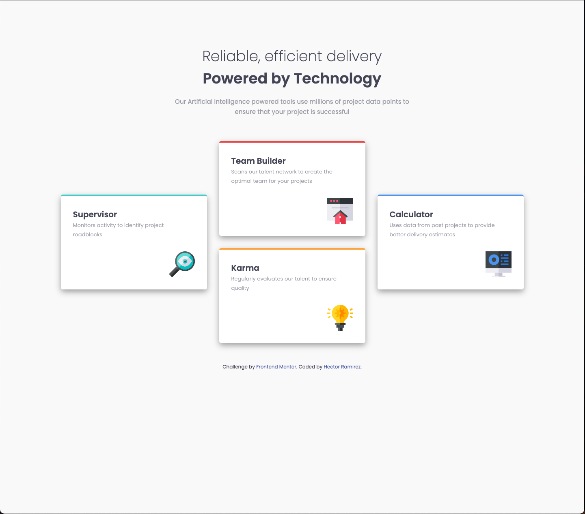
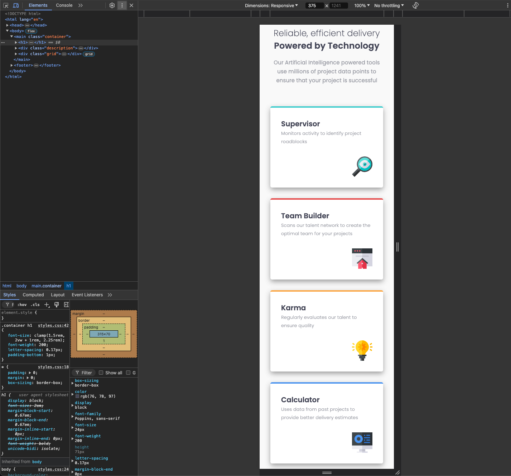

# Frontend Mentor - Four card feature section solution

This is a solution to the [Four card feature section challenge on Frontend Mentor](https://www.frontendmentor.io/challenges/four-card-feature-section-weK1eFYK). Frontend Mentor challenges help you improve your coding skills by building realistic projects.

## Table of contents

- [Overview](#overview)
  - [The challenge](#the-challenge)
  - [Screenshot](#screenshot)
  - [Links](#links)
- [My process](#my-process)
  - [Built with](#built-with)
  - [What I learned](#what-i-learned)
  - [Continued development](#continued-development)
  - [Useful resources](#useful-resources)
- [Author](#author)

## Overview

### The challenge

### Screenshot




### Links

- Solution URL: [Solution URL here](https://github.com/hectorlil48/four-card-feature-section-master)
- Live Site URL: [Live site URL here](https://hectorlil48.github.io/four-card-feature-section-master/)

## My process

### Built with

- Semantic HTML5 markup
- CSS custom properties
- Flexbox
- CSS Grid
- Mobile-first workflow

### What I learned

I learned how to split my H1 into 2 blocks to be able to do the title for the page. I got some practice using the display grid. I used it to give the page one column on mobile. It changes with the screen size. It changed to a 3 row and column container that allowed me to place my cards where I wanted them.

```html
<h1>
  Reliable, efficient delivery<br /><strong>Powered by Technology</strong>
</h1>
```

```css
.gridMobile {
  display: grid;
  gap: 30px;
  grid-template-columns: 1fr;
}

.gridDesktop {
  grid-template-columns: 1fr 1fr 1fr;
  grid-template-rows: auto, 1fr, auto;
  align-items: center;
  justify-items: center;
}
```

### Continued development

I want to get more practice using the display grid. I found that it was pretty helpful to make my websites more responsive.

### Useful resources

- [MDN](https://developer.mozilla.org/en-US/) - MDN is always useful. I was able to get a refresher of the display grid. I learned how to set up my columns and rows. I also learned how to use the clamp function to make font sizes responsive.
- [stackoverflow](https://stackoverflow.co/) - Stackoverflow is always helpful. I looked up some display grid examples.

## Author

- GitHub - [Hector Ramirez](https://github.com/hectorlil48)
- Frontend Mentor - [@hectorlil48](https://www.frontendmentor.io/profile/hectorlil48)
- LinkedIn - [@linkedin.com/in/hector-ramirez-6a6509170](https://www.linkedin.com/in/hector-ramirez-6a6509170/overlay/contact-info/)
